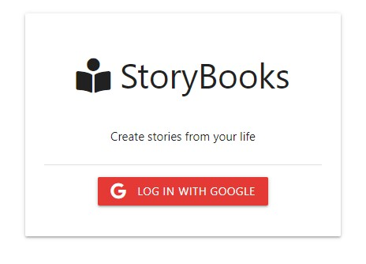
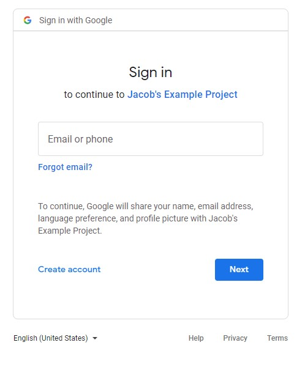

# StoryBooks - OAuth Demo
This app is an example blog website where users can save stories for private use or post publicly to be viewed by the larger audience of writers. It is a Node.js/Express application that allows a user to login using Google OAuth for authentication. 

All data including authorized users, user sessions, and story post details is persisted via MongoDB Atlas. UI was generated using MaterializeCSS and Handlebars for HTML templating.

**NOTE ON REPO USE:** Be sure to add MongoDB URI and Google OAuth credentials to a config.env file if you decide to test this repo yourself.

<table>
<tr>
    <td width="50%" valign="top">
        
    </td>
    <td width="50%" valign="top">
        
    </td>
</tr>
</table>


## Tech Used:
Node, Express, MongoDB, HTML, CSS, JavaScript, Materialize, Handlebars

### Noteable Dependencies 
 * connect-mongo (https://www.npmjs.com/package/connect-mongo)
    * Used to save cookie in database that allowed for user's session to persist.
 * dotenv (https://www.npmjs.com/package/dotenv)
    * Intergration of .env file that allows protection and processing of environment variables.
 * express-handlebars (https://www.npmjs.com/package/express-handlebars)
    * Complements Handlebars framework in an Express environment. Provides view organization and compartmentalization of frontend components through the use of layout, helpers, and partials files.
 * express-session (https://www.npmjs.com/package/express-session)
    * Middleware that aids formating of user session cookie data. Used in cooperation with 'connect-mongo' to store the session in the database.
 * method-override (https://www.npmjs.com/package/method-override)
    * Middleware that allows HTTP verbs like PUT and DELETE to be used when the client doesn't support it. Implemented to provide hidden method on story edit page allowing for update requests merge with the database.
 * moment (https://www.npmjs.com/package/moment)
    * Library for parsing, validating, manipulating, and formatting dates used to clean up date entries on the dashboard.
 * mongoose (https://mongoosejs.com/)
    * Schema-based solution to model application data. Used to validate/organize database user and story entries. 
 * morgan (https://www.npmjs.com/package/morgan)
    * Node. js and Express middleware to log HTTP requests and errors. Used to simply process of testing/troubleshooting during development.
 * passport (https://www.passportjs.org/)
    * Authentication middleware for Node.js. Used to modularize the authentication process with OAuth and Google login.
 * passport-google-oauth20 (https://www.npmjs.com/package/passport-google-oauth20)
    * Passport strategy for authenticating with Google using the OAuth 2.0 API. Helped with processing of client ID and secret.

## Lessons Learned:
* CKEditor script was brought in to provide What-You-See-Is-What-You-Get textarea experience to add/edit story pages. This was a hidden gem for me. 
    * Upon submission of the form, the blog post text was stored in the database with HTML formating of the styles. I look forward to exploring the other editor features in the future.

```
CKEDITOR.replace('body', {
    plugins: 'wysiwygarea, toolbar, basicstyles, link'
})
```


### Acknowledgements:
Traversy Media, Mayanwolfe
